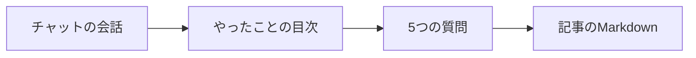
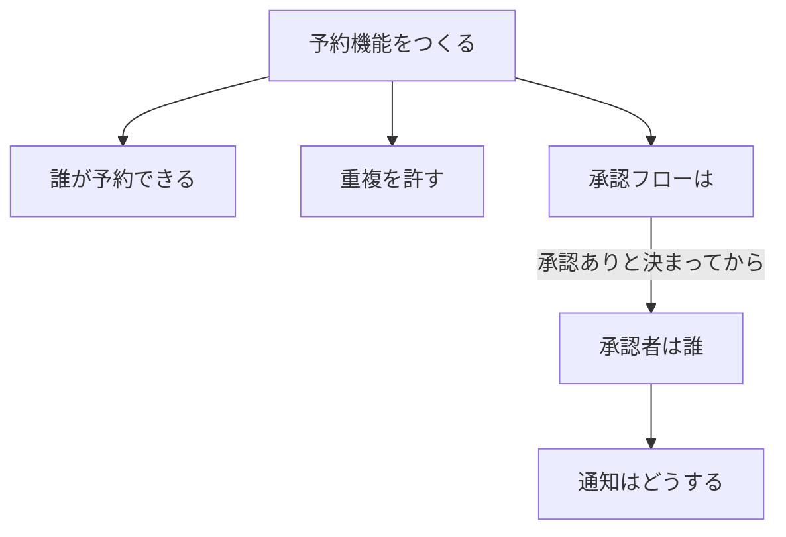
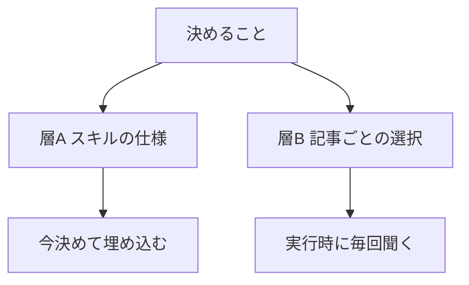
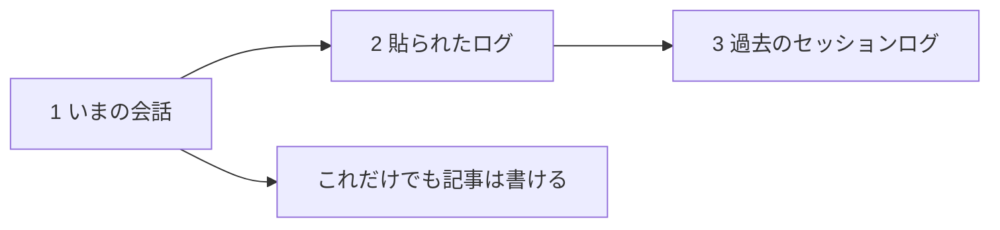

<!-- title: AIに問い詰めさせてからスキルを作ったら、着手前に設計が3回変わった -->

チャットのやり取りを記事に変えるスキルを作りました。コードは1行も書いていません。

でも今日書きたいのは中身じゃなくて、作り方のほうです。実装に入る前に「grilling」という工程を1回通したら、1文字も書かないうちに設計が3回ひっくり返りました 😇

## できたのは Markdown 1枚のスキルです 🙌

`chat-to-article` は、AIとの会話を素材にして、コミュニティに出す記事を書き起こすスキルです。

つまり、会話を放り込むと5問だけ聞かれて記事が出てくる、ということです。

質問は「何の話にするか / 読者 / 主眼 / 公開範囲 / 文体」の5つ。全部に推奨案が付くので、「全部推奨で」の一言で書き始まります 💡

実体は SKILL.md が1ファイル、4,000字ほど。スクリプトも参照ファイルもありません。自作スキルは今9個ありますが、うち7個が同じくスクリプトなしです。

出てくるのは Markdown 1本だけ。保存先は勝手に決めず、毎回聞く形にしてあります。

## grilling は「今聞ける質問」しか聞かない 🔥

きっかけは Matt Pocock のスキル集でした。37個入っているうち、作者が「一番人気、毎回使え」と書いているのが grilling です。本体はたった 2,015バイト。

> 決定事項を設計ツリーとして捉えよ。フロンティアとは、前提がすでに確定している決定の集合——つまり、まだ聞いていない答えを推測せずに、今この瞬間に聞ける質問のことである。

つまり、上の3つが今聞ける質問で、下の2つは今聞いても意味がない、ということです。

普通のAIの確認って、答えていると途中で混乱しませんか。原因はこれだったんですよ。並んだ質問の中に、まだ聞けないものが混ざっている 🤔

もうひとつ効いたのが役割分担でした。

> 事実を見つけるのはお前の仕事であり、断じてユーザーの仕事ではない。(中略)決定はユーザーのものである。

これは後で本当に効いてきます。

## 1回目、作るものが違った 😇

ラウンド2でAIが「どのコミュニティに出しますか」と聞いてきました。それらしい質問なので答えかけて、途中で手が止まりました。

> 私がやりたいのは、記事を作る、ということではありません。記事を作るためのスキルを作る、です。

決めることが、2つの層に分かれていたんですね。

つまり、スキルに埋め込むべきは答えではなく「聞く仕組み」だった、ということです。

気づかず進んでいたら、特定の投稿先向けの設定が焼き付いた、自分にしか使えないものができていました。配布するつもりだったのに 😅

面白いのは、止めたのが私だったことです。grilling は完璧な質問をくれる魔法ではなくて、答えているうちに違和感が育つ場を作る仕掛けなんだと思います。

## 2回目、34MB という物理 🤯

「プロジェクト全体の会話ログを素材にする」と決めた直後、AIが勝手に実測してきました。

プロジェクトAが9セッションで34MB、Bが1セッションで15MB、Cはログが1本も残っていない。文脈に入る量ではありません。

ここは「事実はAIが調べる」がきれいに効いた場面でした。私は「全体を素材に」と言っただけで、それが何MBになるかは知らなかったんですよ 💡

しかもログがゼロのプロジェクトが実在した。過去ログがある前提で設計していたら、そこで詰んでいました。

## 3回目、スクリプトが丸ごと消えた 🔥

一番痛かったのがこれです。配布物にすること、Gemini でも使いたいことを伝えた瞬間でした。

Gemini でスキル化するとプロンプト文しか登録できません。スクリプトが置けない。ファイルも読めない。過去ログのパスはそもそも存在しない。

ログから発言を抜く処理は機械的なので、スクリプトを持つのが正しいと私も思っていて、いったんそう決めていました。それが一撃で消えました 😇

残ったのが、この形です。

つまり、素材は上から使えるものを使い、いまの会話だけでも成立させる、ということです。

Gemini で長い1本のチャットで作りきったなら、その会話が全体像そのものですからね。制約に合わせて削ったら、かえって素直な設計になりました 🙌

## 使ったら要件定義書みたいな記事が出てきた 🫠

grilling は結局5ラウンド。記録では、設計から実装まで1時間24分でした。完成したので、さっそくこの会話自体を素材に回しました。

仕様どおりに動いたし、伏せ字も効いた。ただ、出てきた文章が固いんです。「〜を実現した」「〜が可能となる」。読み返して、これは仕様書だなと 😇

そこで SKILL.md に文体の節を足して、質問を5つ目まで増やしました。ゆるっと / ていねい / きっちり / 実況 / さくっと / ハンズオン の6種から選ぶ形です。この記事は「ゆるっと」で出しています。

ついでに、伏せ字の「グレーゾーンは残したうえで理由つきで報告する」も足しました。伏せるか残すかは、実際には全か無かではないので 🤔

作る前にどれだけ詰めても、使ってみないと分からないものはありますね。

## 真似するなら、ここだけ 👋

一番効いたのは、質問に答えたことそのものより、答えているうちに「なんか違う」が育ったことでした。3回とも、設計を崩したのは答えではなく、答えている最中の違和感のほうです。

なので、AIに何か作らせる前に一度「今聞ける質問だけ全部出して」と言ってみてください。着手後に判明するはずだった穴が、いくつか前倒しになります 💡

同じことを試して「うちでは効かなかった」があれば、ぜひ聞かせてください。私は次に、このスキルが Gemini でも同じ挙動になるかを確かめるつもりです。

- grilling の原典: https://github.com/mattpocock/skills (skills/productivity/grilling/SKILL.md)
- 最初に解説してもらっていたスキル集: https://github.com/plannotator/effective-html
